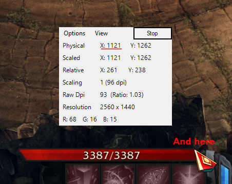

# Download

[https://github.com/hxhieu/LostTools/releases](https://github.com/hxhieu/LostTools/releases/latest)

# Usage

- You should be able to get the mouse position by any mean. I would recommend this [MPos](https://sourceforge.net/projects/mpos/)

- Open the `settings.json` file with Notepad and edit the following to match with your environment i.e. use MPos to find the life bar position. **Try the top red part of the bar, so to avoid the white text**

- `StartX` and `Y` 

  

- `EndX` 

  

- `PotsKey` is default to `F1`, difference key codes can be found [virtual-key-codes](https://docs.microsoft.com/en-us/windows/win32/inputdev/virtual-key-codes). They are HEX so use Google to convert for example `70 hex to decimal` => 112

- Run the tool as Administrators and you should be set

  